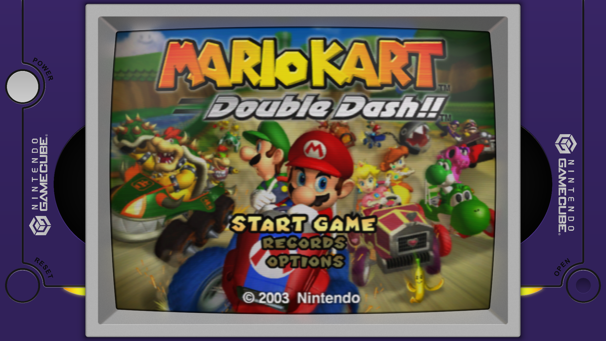
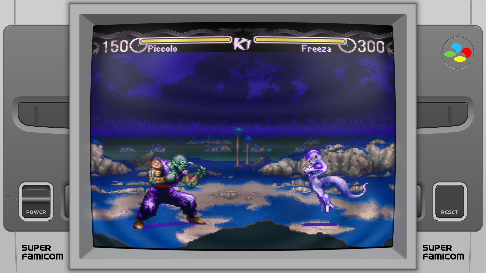

# HSM Reflection Shader Graphics

## 4K System graphics created specifically for use with the HSM Mega Bezel Reflection Shader.

This project is an attempt to provide end users with high quality art to use in conjunction with the amazing **Mega Bezel Reflection Shader** created by **HyperspaceMadness**.

My feedback and announcement page is on Libretro:

https://forums.libretro.com/t/duimon-hsm-reflection-shader-graphics-feedback-and-updates/28146

The shader feedback and announcement page is at:

https://forums.libretro.com/t/hsm-mega-bezel-reflection-shader-feedback-and-updates/25512

While developing this art I have a few select goals.

* All art will be vector based.
* If raster effects are used at any point they will be 300dpi. This may include text layer imports from Photoshop.
* Backgrounds, for graphics that don’t fill the screen, may be raster images, with the intent that (In future shader versions) users can swap in a background of their choosing.
* High quality is a must! When using existing art as a reference, it will be paired with photographic references in an effort to improve it's realism and give it a cohesive style.
* Final raster output of 4K at 300dpi
* All project files will be provided. Layer structure within the project files will assume that an end user may want to change the bezel size or placement, and *attempt* to make balancing the artwork easy.
* Inclusion of logo, night, plain, and 4K vertical versions, where they make sense.

Some screenshots...







## Mega_Bezel_Community

**The paths in my presets have been changed!**

In a move to normalize installations, and keep the shaders folder clean and tidy, the Mega Bezel artistic community has agreed to make it possible to install our various releases in a "Mega_Bezel_Community" folder. (Within the shader folder.)

AFAIK we are all now using relative paths to our assets and absolute paths to HSM's base presets.

This means that adoption of the standard is not mandatory.

___

Most of this will have no effect on usage, but if you decide to adopt the new standard, (And I hope you will.) and are referencing any of my presets, you will need to update your paths.

In an effort to promote this standard I have changed the path in the following installation guide.

So the new file structures is...

    Retroarch/shaders/Mega_Bezel_Community/Duimon-Mega-Bezel
        	/Graphics
        	/Presets


An example presets folder and contents is...

    Retroarch/shaders/Mega_Bezel_Community/Duimon-Mega-Bezel
    		/Presets
    			/Nintendo_3DS
    				3DS-[ADV]-[LCD-GRID].slangp
    				3DS-[ADV]-[LCD-GRID]-[Night].slangp
    				3DS-[STD]-[LCD-GRID].slangp
    				3DS-[STD]-[LCD-GRID]-[Night].slangp
    				3DS_Vertical-[ADV]-[LCD-GRID]-[Integer].slangp
    				3DS_Vertical-[ADV]-[LCD-GRID]-[Integer]-[Night].slangp
    				3DS_Vertical-[STD]-[LCD-GRID]-[Integer].slangp
    				3DS_Vertical-[STD]-[LCD-GRID]-[Integer]-[Night].slangp
    				3DS_Vertical_Alt-[ADV]-[Guest].slangp
    				3DS_Vertical_Alt-[ADV]-[Guest]-[Night].slangp
    				3DS_Vertical_Alt-[STD]-[Guest].slangp
    				3DS_Vertical_Alt-[STD]-[Guest]-[Night].slangp


You can install everything to a local clone and update using the following method.

1. Install Git. [https://git-scm.com/downloads](https://git-scm.com/downloads) using the default settings.
2. Enter the "/Retroarch/shaders" folder and create a "Mega_Bezel_Community" folder if one does not exist.
3. Enter the "Retroarch/shaders/Mega_Bezel_Community" folder and from the command-line run:

```
git clone https://github.com/Duimon/Duimon-Mega-Bezel
```

it will create a "Duimon-Mega-Bezel" folder inside the Mega_Bezel_Community folder. 

To update, go into *the "Duimon-Mega-Bezel" folder* (note difference) and run

```
git pull
```
___

**Thanks @drstupid for the method.**
___


Load your content and then a preset. I recommend creating a core preset next.

Since RA 1.9.1 and the Mega Bezel shader v0.9.00 release, you need to have "Simple Presets" enabled when saving a preset. This will save only changes you make and a reference to the currently loaded preset. This will stop your preset from breaking as I update my presets and HSM updates the shader.

If you are using a multiple system core, and using it for multiple systems, I recommend creating a content directory preset.

---

I hope this makes it easier on some who have had a tough time getting up and running. I also recommend starting with a clean install of RetroArch and following HSMs instructions from the shader thread.

### LICENSE
*******************
All the assets, including documentation and code, are published under the 'Attribution-NonCommercial-ShareAlike 4.0 International (CC BY-NC-SA 4.0)' Creative Commons license.

Extract from ['CC BY-NC-SA 4.0' Commons Deed](https://creativecommons.org/licenses/by-nc-sa/4.0/deed.en):


> You are free to:
> - Share &#8212; copy and redistribute the material in any medium or format
> - Adapt &#8212; remix, transform, and build upon the material
> 
> The licensor cannot revoke these freedoms as long as you follow the license terms.
> 
> Under the following terms:
>
> - Attribution &#8212;You must give appropriate credit, provide a link to the license, and indicate if changes were made. You may do so in any reasonable manner, but not in any way that suggests the licensor endorses you or your use.
> - NonCommercial &#8212; You may not use the material for commercial purposes.
> - ShareAlike &#8212; If you remix, transform, or build upon the material, you must distribute your contributions under the same license as the original.
> - No additional restrictions &#8212; You may not apply legal terms or technological measures that legally restrict others from doing anything the license permits.

For further reading check the ['CC BY-NC-SA 4.0' legal code](https://creativecommons.org/licenses/by-nc-sa/4.0/legalcode.en).